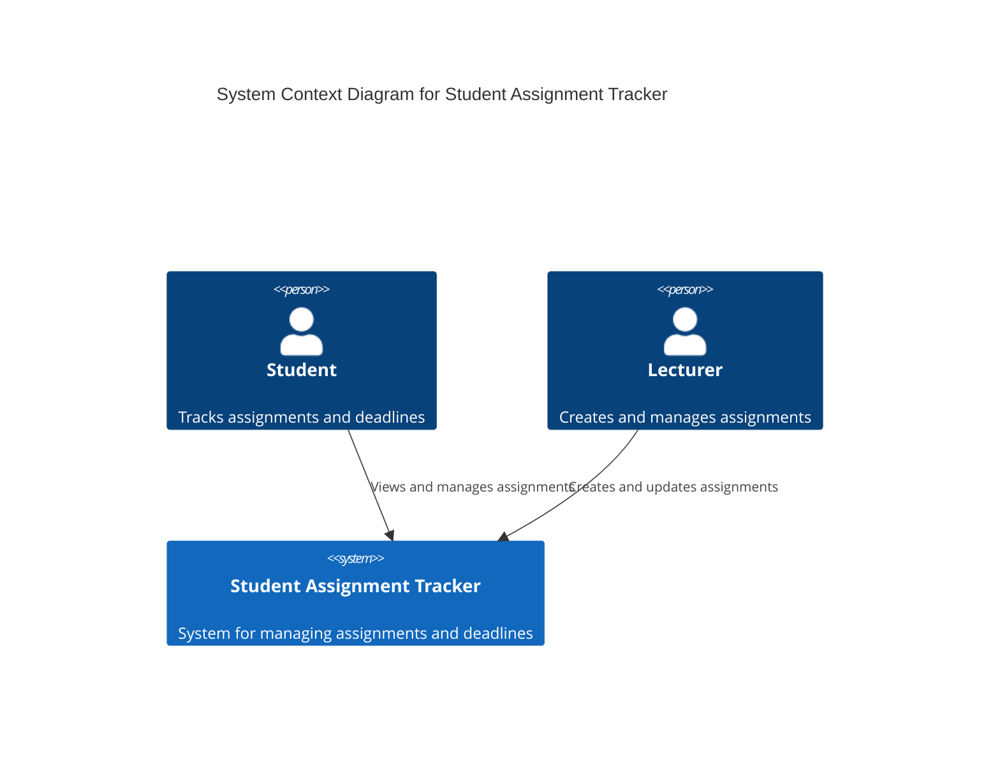
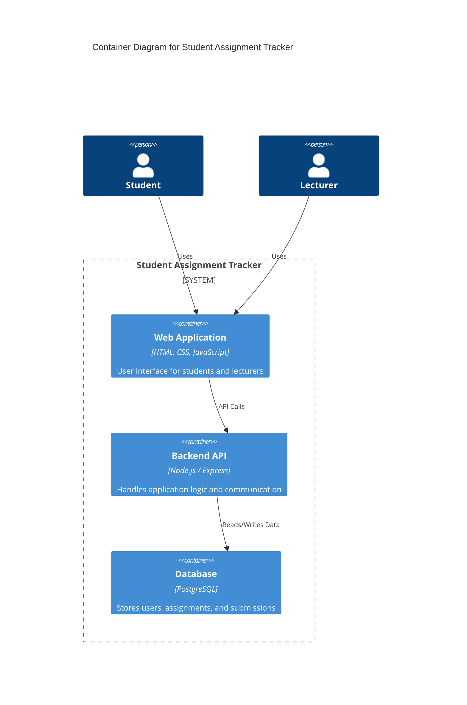

# Student Assignment Tracker – System Architecture

## 1. Project Title

Student Assignment Tracker

---

## 2. Domain

Education Technology (EdTech)

The system operates within the education domain and focuses on helping students and lecturers manage coursework and assignment deadlines.

---

## 3. Problem Statement

Students often struggle to track assignments and deadlines across multiple courses. Lecturers also need an efficient way to distribute assignments and communicate deadlines to students. The Student Assignment Tracker provides a centralized platform where assignments can be created, tracked, and managed efficiently.

---

# 4. C4 Architecture Model

The system architecture is represented using the **C4 model**, which describes the system at different levels of abstraction:

1. System Context Diagram
2. Container Diagram
3. Component Diagram

---

# 5. System Context Diagram

The System Context Diagram shows how the system interacts with external users.

---

# 6. Container Diagram

The Container Diagram shows the high-level technical building blocks of the system.

