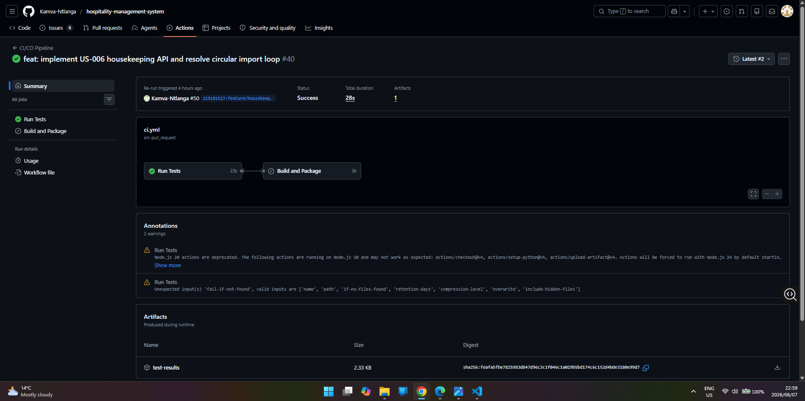

# ✅ Merged Pull Requests — Cross-Project Contributions

## Assignment 15: Cross-Project Contributions & Collaborative Development

**Contributor:** Mongameli Shasha (219181527)

---

## Summary

| # | Repository | PR | Type | Status |
|---|-----------|-----|------|--------|
| 1 | AkhonaHlongwa/software-engineering-assignment | [#11](https://github.com/AkhonaHlongwa/software-engineering-assignment/pull/11) | Refactor | ✅ Merged |
| 2 | Kamva-Ntlanga/hospitality-management-system | [#50](https://github.com/Kamva-Ntlanga/hospitality-management-system/pull/50) | Feature | ✅ Merged |
| 3 | 211225347/Smart-Academic-Library-Assistance-System-SALAS- | [#39](https://github.com/211225347/Smart-Academic-Library-Assistance-System-SALAS-/pull/39) | Feature | ✅ Merged |

---

## PR 1 — AkhonaHlongwa/software-engineering-assignment

**PR Link:** https://github.com/AkhonaHlongwa/software-engineering-assignment/pull/11

**Title:** `refactor: standardize API global exception handlers and structural error payloads`

**Issue Addressed:** Issue #4 — Improve API Error handling responses

**CI Status:** ⚠️ No CI pipeline configured on this repository

### Changes Made

- Introduced a unified global exception handling matrix using FastAPI's
  middleware validation layers
- Built structural error schemas using Pydantic — every intercepted error
  returns a standardized JSON structure with `timestamp`, `error_code`,
  `message`, and `detail` fields
- Mapped domain error classes to precise HTTP status codes:
  - Input validation failures → `422 Unprocessable Entity`
  - Parameter conflicts → `409 Conflict`
  - Resource not found → `404 Not Found`
  - Unauthorized access → `403 Forbidden`
- Removed raw try-except blocks from individual endpoint routes and
  delegated all error interception to an isolated application-wide handler

### Impact

Eliminated database traceback leakage to clients, improved API security,
and standardized error response format across all endpoints — making the
API predictable and easier to consume by frontend clients.

---

## PR 2 — Kamva-Ntlanga/hospitality-management-system

**PR Link:** https://github.com/Kamva-Ntlanga/hospitality-management-system/pull/50

**Title:** `feat: implement US-006 housekeeping view/manage API routes and resolve circular imports`

**Issue Addressed:** Issue #6 — US-006: View and manage housekeeping tasks

**CI Status:** ✅ CI passing — Run Tests green in 23s

### Changes Made

- **Resolved circular dependency deadlock** across routing, service, and
  database schema packages by moving cross-module imports into local method
  scopes, bypassing global scope initialization deadlock
- Built `GET /housekeeping` endpoint with query parameter filtering by
  urgency level, assigned staff ID, and room number
- Built `PATCH /housekeeping/{id}` endpoint for updating room status
  across the enum matrix (`Clean`, `Dirty`, `Under-Maintenance`) with
  automatic propagation to the master room availability flag

### Impact

Unblocked the application from a boot-time circular import crash and
delivered the complete US-006 housekeeping management feature as defined
in the project's user story backlog.

---

## PR 3 — 211225347/Smart-Academic-Library-Assistance-System-SALAS-

**PR Link:** https://github.com/211225347/Smart-Academic-Library-Assistance-System-SALAS-/pull/39

**Title:** `feat(reservations): implement reservation domain models and business validation layer`

**Issue Addressed:** Issue #36 — Add Reservation API endpoints

**CI Status:** ⚠️ No CI pipeline configured on this repository

### Changes Made

- **Expanded `src/models.py`** with missing domain classes that were
  causing runtime crashes:
  - `Reservation` — with `_student`, `_resource`, and position tracking
  - `ReservationStatus` — enum (`PENDING`, `QUEUED`, `FULFILLED`, `CANCELLED`)
  - `AccountStatus` — enum for student account state
  - `FineStatus` — enum for outstanding fine tracking
- **Replaced mock routes** in `api/main.py` with real persistence-backed
  endpoints connected to `InMemoryReservationRepository`
- **Implemented three business validation layers:**
  - **Shelf Availability Guard** — rejects reservations with `HTTP 400`
    if physical copies are available on shelves (`available_copies > 0`)
  - **Quota Cap Safeguard** — caps student profiles at 3 active
    pending/queued reservations, returning `HTTP 409` on violation
  - **Dynamic Waitlist Allocation** — evaluates existing reservation
    queue sizes and routes overflow requests to `ReservationStatus.QUEUED`

### Impact

Resolved application boot crashes caused by missing domain models,
replaced non-functional mock endpoints with a fully operational
reservation system, and implemented all business rules required for
realistic library reservation management.

---

## CI Evidence

| Repository | CI Status | Evidence |
|-----------|-----------|---------|
| AkhonaHlongwa/software-engineering-assignment | ⚠️ No CI configured | Verified locally |
| Kamva-Ntlanga/hospitality-management-system | ✅ Passing | Screenshot attached above |
| 211225347/Smart-Academic-Library-Assistance-System-SALAS- | ⚠️ No CI configured | Verified locally |

> **Note:** Two of the three repositories did not have a CI pipeline
> configured at the time of contribution. Changes were verified by running
> tests locally in each project's environment before submitting the PR.
> The one repository with CI (`Kamva-Ntlanga/hospitality-management-system`)
> shows a green pipeline run on PR #50.