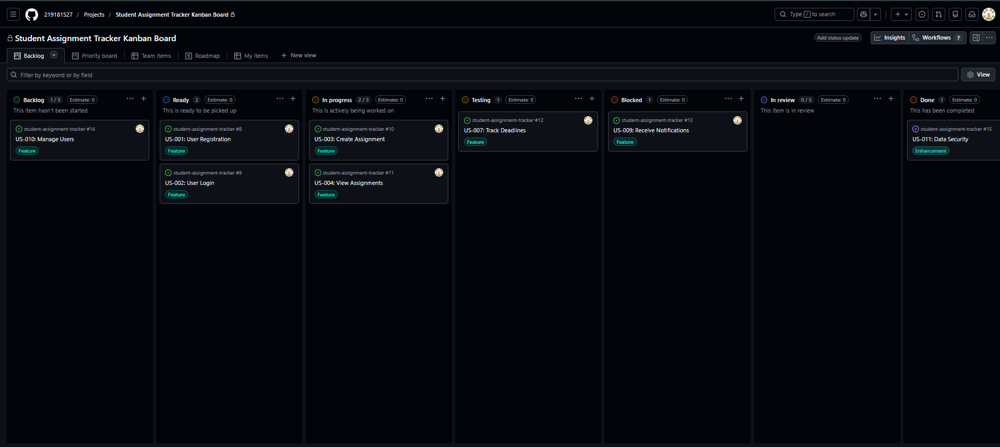

# Student Assignment Tracker

## 📌 Project Overview

The **Student Assignment Tracker** is a software system designed to help students manage their academic workload efficiently. The system enables students to track assignments, monitor deadlines, and manage submissions, while lecturers can create and manage coursework.

This project demonstrates a complete **Software Engineering lifecycle**, including requirements engineering, system design, and Agile project management using GitHub tools.

---

## 🌍 Domain

**Education Technology (EdTech)**

The system operates within the education domain, focusing on improving how students and lecturers manage coursework and assignment deadlines.

---

## 🎯 Project Goals

The system aims to:

* Allow lecturers to create and publish assignments
* Allow students to view assignments and due dates
* Help students track submission status
* Provide a structured platform for managing academic tasks

---

## ⚙️ Agile Project Management

This project applies **Agile (Scrum) principles** using GitHub:

* 📌 User Stories implemented as GitHub Issues
* 🏷️ Labels used for prioritisation and categorisation
* 📊 Kanban Board used to track workflow and progress
* 🎯 Milestones used to define sprint goals
* 📅 Sprint Planning documented for development cycles

---

## 📊 Kanban Board

The project uses a **GitHub Kanban Board** (Automated Kanban template) to manage development tasks and visualize workflow.

### 🔧 Customizations

The board was customized to better reflect a real Agile workflow by adding the following columns:

* **Testing** – Ensures features are verified before completion
* **Blocked** – Highlights tasks that cannot proceed due to dependencies

These additions improve workflow visibility, support quality assurance, and help identify bottlenecks early.

### 📸 Board Overview



---

## 📁 Repository Structure

```text
student-assignment-tracker
│
├── .gitignore
├── LICENSE
├── README.md
├── SPECIFICATION.md
├── ARCHITECTURE.md
│
├── docs/
│   ├── STAKEHOLDERS.md
│   ├── REQUIREMENTS.md
│   ├── USE_CASES.md
│   ├── USE_CASE_SPECIFICATIONS.md
│   ├── TEST_CASES.md
│   ├── USER_STORIES.md
│   ├── PRODUCT_BACKLOG.md
│   ├── SPRINT_PLANNING.md
│   ├── TEMPLATE_ANALYSIS.md         
│   ├── KANBAN_EXPLANATION.md         
│   ├── project_reflection.md         
│   ├── REFLECTION.md
│   └── USE_CASE_TEST_REFLECTION.md
│
├── screenshots/
│   └── kanban_board.png
```

---

## 📚 Documentation

### 📄 Core Documents

* [System Specification](./SPECIFICATION.md)
* [System Architecture](./ARCHITECTURE.md)

### 👥 Requirements Engineering

* [Stakeholder Analysis](./docs/STAKEHOLDERS.md)
* [System Requirements](./docs/REQUIREMENTS.md)

### 📊 Analysis & Design

* [Use Case Diagram & Description](./docs/USE_CASES.md)
* [Use Case Specifications](./docs/USE_CASE_SPECIFICATIONS.md)

### 🧪 Testing

* [Test Cases](./docs/TEST_CASES.md)

### 🚀 Agile Planning

* [User Stories](./docs/USER_STORIES.md)
* [Product Backlog](./docs/PRODUCT_BACKLOG.md)
* [Sprint Planning](./docs/SPRINT_PLANNING.md)

### 📊 Project Management (Assignment 7)

* [Template Analysis and Selection](./docs/TEMPLATE_ANALYSIS.md)
* [Kanban Board Explanation](./docs/KANBAN_EXPLANATION.md)
* [Project Reflection](./docs/KANBAN_REFLECTION.md)

### 🧠 Additional Reflection

* [General Reflection](./docs/REFLECTION.md)
* [Use Case & Testing Reflection](./docs/USE_CASE_TEST_REFLECTION.md)

---

## 🛠️ Project Management Approach

The project uses GitHub tools to support Agile development:

* Issues for tracking user stories
* Labels for organisation and prioritisation
* Kanban board for workflow management
* Milestones for sprint planning

---

## 👤 Author

**Mongameli Shasha**
Student Number: **219181527**
GitHub: https://github.com/219181527

---


