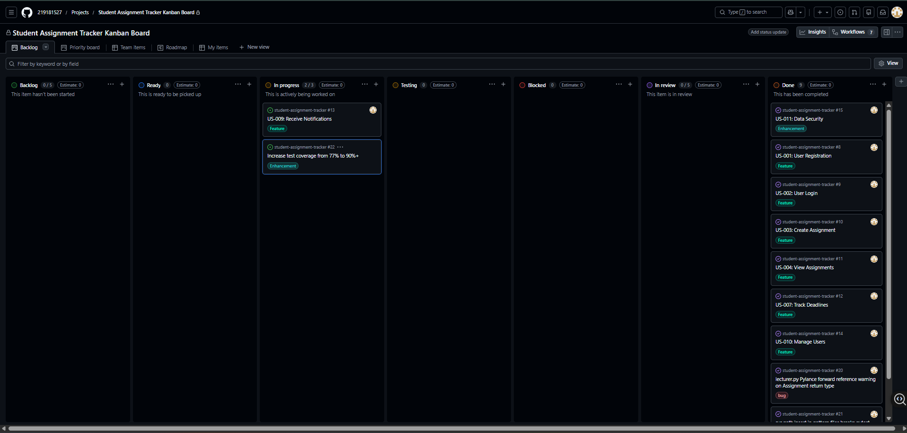

# Student Assignment Tracker

A backend system for managing academic coursework — built in Python, designed around clean architecture principles, and structured for extensibility.

---

## 📌 Overview

The **Student Assignment Tracker** solves a common problem in higher education: students losing track of deadlines across multiple courses, and lecturers lacking a structured platform for distributing and managing coursework.

The system provides:
- A centralised interface for students to view, filter, and monitor assignment deadlines across all enrolled courses
- A management layer for lecturers to create, publish, update, and close assignments
- Automated notifications triggered by deadlines, submissions, and grade releases
- A structured submission and grading pipeline with full status tracking

---

## 🌍 Domain

**Education Technology (EdTech)**

The system occupies the middle ground between overengineered institutional LMS platforms and informal tools like WhatsApp groups — lightweight, role-based, and deadline-focused.

---

## 🎯 Goals

| Goal | Description |
|------|-------------|
| Assignment Management | Lecturers can create, publish, update, and close assignments per course |
| Deadline Visibility | Students see all upcoming deadlines across enrolled courses in one place |
| Submission Tracking | Students can submit work and track submission and grading status |
| Notifications | System generates alerts for deadlines, submission confirmations, and grade releases |
| Role-Based Access | Students and lecturers see and do different things based on their role |

---

## 🛠️ Tech Stack

| Tool | Purpose |
|------|---------|
| Python 3.14 | Primary implementation language |
| FastAPI | REST API framework with auto OpenAPI docs |
| Uvicorn | ASGI server |
| Pydantic v2 | Request/response validation and serialisation |
| pytest 9.x | Unit and integration testing — 265 tests |
| pytest-cov | Coverage reporting |
| httpx | HTTP client for API integration tests |
| Mermaid.js | UML diagrams embedded in Markdown |
| GitHub Projects | Kanban board, sprint planning, issue tracking |

---

## 📁 Project Structure

```text
student-assignment-tracker/
│
├── .github/
│   └── workflows/
│       └── ci.yml                ← GitHub Actions CI/CD pipeline
│
├── src/                          ← Domain model classes
│   ├── user.py
│   ├── student.py
│   ├── lecturer.py
│   ├── course.py
│   ├── assignment.py
│   ├── submission.py
│   ├── grade.py
│   ├── notification.py
│   └── enrollment.py
│
├── creational_patterns/          ← Object creation design patterns
│   ├── simple_factory.py
│   ├── factory_method.py
│   ├── abstract_factory.py
│   ├── builder.py
│   ├── prototype.py
│   └── singleton.py
│
├── repositories/                 ← Persistence layer
│   ├── base.py
│   ├── interfaces.py
│   ├── inmemory/
│   ├── filesystem/
│   ├── database/
│   └── factory/
│
├── services/                     ← Business logic layer
│   ├── base.py
│   ├── user_service.py
│   ├── assignment_service.py
│   └── submission_service.py
│
├── api/                          ← REST API layer (FastAPI)
│   ├── main.py
│   ├── schemas.py
│   ├── dependencies.py
│   └── routes/
│       ├── users.py
│       ├── assignments.py
│       └── submissions.py
│
├── tests/                        ← Full test suite (395 tests)
│   ├── conftest.py
│   ├── test_simple_factory.py
│   ├── test_factory_method.py
│   ├── test_abstract_factory.py
│   ├── test_builder.py
│   ├── test_prototype.py
│   ├── test_singleton.py
│   ├── test_repository_factory.py
│   ├── test_storage_backends.py
│   ├── services/
│   │   ├── test_user_service.py
│   │   ├── test_assignment_service.py
│   │   └── test_submission_service.py
│   └── api/
│       └── test_api.py
│
├── docs/                         ← System documentation
│   ├── api/
│   │   ├── openapi.yaml
│   │   ├── API_DOCS.md
│   │   ├── swagger_ui.png
│   │   └── swagger_ui_detail.png
│   ├── export_openapi.py
│   ├── DOMAIN_MODEL.md
│   ├── CLASS_DIAGRAM.md
│   ├── state_diagrams/
│   └── activity_diagrams/
│
├── screenshots/
│   ├── kanban_board.png
│   ├── branch_protection.png
│   ├── ci_passing.png
│   ├── cd_passing.png
│   ├── artifact.png
│   ├── release.png
│   └── pr_blocked.png
│
├── requirements.txt              ← Pinned dependencies for CI
├── pytest.ini
├── PROTECTION.md                 ← Branch protection documentation
├── CHANGELOG.md
└── README.md
```

---

## ⚙️ CI/CD Pipeline

This project uses **GitHub Actions** for automated testing and releases.

### How It Works

```
Push to any branch
      ↓
CI: Run 395 tests (pytest)
      ↓
  Tests pass? ──No──→ PR blocked from merging
      ↓ Yes
Merge to main approved
      ↓
CD: Build Python wheel
      ↓
GitHub Release created automatically (v1.0.x)
```

### Workflow File

[`.github/workflows/ci.yml`](./.github/workflows/ci.yml)

| Job | Trigger | What it does |
|-----|---------|-------------|
| `Run Tests` | Every push, every PR | Runs 395 tests, uploads results + coverage as artifacts |
| `Build Release Artifact` | Merge to `main` only | Builds Python wheel, creates GitHub Release |

### Running Tests Locally

```bash
# Install dependencies
pip install -r requirements.txt

# Run full test suite
pytest tests/ -v

# With coverage report
pytest tests/ -v --cov=src --cov=creational_patterns --cov=repositories --cov=services --cov=api --cov-report=term-missing
```

### Branch Protection

The `main` branch is protected:
- All changes must go through a pull request
- CI must pass before merging is allowed
- At least 1 review required
- See [`PROTECTION.md`](./PROTECTION.md) for full details

---


### Prerequisites

- Python 3.8+
- pip

### Installation

```bash
git clone https://github.com/219181527/student-assignment-tracker.git
cd student-assignment-tracker
pip install pytest pytest-cov fastapi uvicorn httpx
```

### Run the API

```bash
uvicorn api.main:app --reload
```

| URL | Description |
|-----|-------------|
| `http://localhost:8000/docs` | Swagger UI — interactive API explorer |
| `http://localhost:8000/redoc` | ReDoc — clean reference documentation |
| `http://localhost:8000/health` | Health check |
| `http://localhost:8000/openapi.json` | Raw OpenAPI spec |

### Run Tests

```bash
# Full test suite
pytest tests/ -v

# With coverage report
pytest tests/ -v --cov=src --cov=creational_patterns --cov=repositories --cov=services --cov=api --cov-report=term-missing
```

### Verify CRUD Operations

```bash
python -c "
from repositories.factory import RepositoryFactory
from src.student import Student

factory = RepositoryFactory('MEMORY')
repo = factory.get_student_repository()

s = Student('s1', 'Alice', 'alice@uni.ac.za', 'pass', 'STU001', 2)
s.register()
repo.save(s)

print(repo.find_by_id('s1'))        # Student object
print(repo.exists('s1'))            # True
print(repo.count())                 # 1

s.update_profile(name='Alice Updated')
repo.save(s)
print(repo.find_by_id('s1').name)   # Alice Updated

repo.delete('s1')
print(repo.find_by_id('s1'))        # None
"
```

---

## 🏗️ Architecture

### Domain Layer (`/src`)

Nine domain classes with private attributes, typed method signatures, and enforced business rules:

| Class | Responsibility |
|-------|---------------|
| `User` | Base class — authentication, registration, profile management |
| `Student` | Deadline tracking, assignment submission, enrollment access |
| `Lecturer` | Assignment lifecycle management with ownership enforcement |
| `Course` | Owns assignments (composition), tracks enrollments (aggregation) |
| `Assignment` | `DRAFT → PUBLISHED → CLOSED` lifecycle, triggers notifications on publish |
| `Submission` | Late detection at construction time, triggers grade notifications |
| `Grade` | Score storage, percentage computation against total marks |
| `Notification` | Typed alerts (`DEADLINE`, `SUBMISSION`, `GRADE`) with traceable source |
| `Enrollment` | Resolves the `Student ↔ Course` many-to-many relationship |

---

### Creational Patterns (`/creational_patterns`)

Six design patterns applied to real domain problems:

| Pattern | Applied To | Why |
|---------|-----------|-----|
| Simple Factory | `UserFactory` | Registration sends a role string — one factory creates `Student` or `Lecturer` without exposing subclass imports |
| Factory Method | `NotificationCreator` | Each trigger type builds differently-worded notifications — subclasses own their construction logic independently |
| Abstract Factory | `DashboardFactory` | Students and lecturers see incompatible views of the same data — factory guarantees compatible component families per role |
| Builder | `AssignmentBuilder` + `AssignmentDirector` | Assignments have 9+ configurable fields — builder prevents half-built objects; Director provides named templates (quiz, essay, project) |
| Prototype | `AssignmentTemplateRegistry` | Recurring assignments cloned from registered templates — mutations on clones never affect the stored original |
| Singleton | `NotificationService` | One global dispatcher prevents duplicate alerts — double-checked locking for thread safety |

---

### Service Layer (`/services`)

Business logic encapsulated in three service classes, each injected with a `RepositoryFactory`:

| Service | Responsibility |
|---------|---------------|
| `UserService` | Registration (duplicate prevention), login, profile updates |
| `AssignmentService` | Full `DRAFT → PUBLISHED → CLOSED` lifecycle with ownership enforcement |
| `SubmissionService` | Enrollment validation, one-submission rule, score range checks, grading |

All services share a typed exception hierarchy that maps directly to HTTP status codes:

| Exception | HTTP | Meaning |
|-----------|------|---------|
| `NotFoundError` | 404 | Entity does not exist |
| `ConflictError` | 409 | Business rule violation |
| `PermissionError` | 403 | Unauthorised action |
| `ValidationError` | 422 | Invalid input data |

---

### REST API (`/api`)

Built with **FastAPI**. Auto-documented via Swagger UI at `/docs`.

**25 endpoints across 3 routers:**

| Router | Prefix | Endpoints |
|--------|--------|-----------|
| Users | `/api/users` | Register, login, get, list, update students and lecturers |
| Assignments | `/api/assignments` | Create, publish, close, delete, update, list, overdue |
| Submissions | `/api/submissions` | Submit, grade, get, list by assignment/student |

See [`docs/api/API_DOCS.md`](./docs/api/API_DOCS.md) for the full endpoint reference.

---

### Persistence Layer (`/repositories`)

A repository pattern implementation with swappable storage backends:

```
Repository[T, ID]              ← Generic interface (6 CRUD operations)
    └── StudentRepository      ← Entity interface (+ domain-specific finders)
            ├── InMemoryStudentRepository     ← dict / HashMap
            ├── FileSystemStudentRepository   ← JSON files
            └── DatabaseStudentRepository     ← SQL/NoSQL (pluggable)
```

**Generic interfaces** — `save`, `find_by_id`, `find_all`, `delete`, `exists`, `count` defined once in `base.py`, inherited by all nine entity repositories. Domain-specific finders (`find_by_course`, `find_overdue`, `find_by_student_and_assignment`) declared per entity interface.

**In-memory** — Python `dict` backing store. O(1) CRUD, zero setup. Default for testing and local development.

**Filesystem** — JSON file backing store. Data persists across restarts. Fully implemented for `Student`, `Course`, `Lecturer`, and `Notification`.

**Database** — Pluggable stub. All methods raise `NotImplementedError` with implementation guidance. To activate: install SQLAlchemy or PyMongo, implement the stub classes, switch `RepositoryFactory("DATABASE")`. Zero changes to domain classes or tests required.

#### Storage Abstraction — `RepositoryFactory`

Switching backends is a single line:

```python
factory = RepositoryFactory("MEMORY")      # default — no setup required
factory = RepositoryFactory("FILESYSTEM")  # persistent JSON storage
factory = RepositoryFactory("DATABASE")    # production database
```

The Factory Pattern was chosen over Dependency Injection because the storage backend is an application-wide decision made at startup — not a per-service concern. All repositories share the same backend, making a factory simpler and equally flexible.

| Consideration | Factory ✅ | Dependency Injection |
|---------------|-----------|---------------------|
| Backend decision scope | Application-wide | Per-component |
| Configuration | Single string | DI container required |
| Complexity | Low | Higher |
| Best for | One backend for all services | Different backends per service |

---

## 🧪 Testing

```
265 tests | 74%+ coverage
```

| Module | Tests | What's covered |
|--------|-------|---------------|
| `test_simple_factory.py` | 13 | Role creation, case-insensitivity, password hashing |
| `test_factory_method.py` | 16 | All three notification creators |
| `test_abstract_factory.py` | 19 | Component families, role compatibility |
| `test_builder.py` | 22 | Attribute setting, chaining, Director templates |
| `test_prototype.py` | 15 | Clone independence, registry isolation |
| `test_singleton.py` | 16 | Identity, thread safety (20 threads) |
| `test_repository_factory.py` | 32 | Backend routing, caching, isolation |
| `test_storage_backends.py` | 39 | FileSystem CRUD, JSON persistence |
| `tests/services/test_user_service.py` | 21 | Registration, login, profile management |
| `tests/services/test_assignment_service.py` | 22 | Assignment lifecycle, ownership rules |
| `tests/services/test_submission_service.py` | 30 | Submission, grading, score validation |
| `tests/api/test_api.py` | 30 | End-to-end API integration tests |

---

## 📊 Project Management

Development tracked using GitHub's native tooling:

- **Issues** — features, bugs, and enhancements with labels (`feature`, `bug`, `enhancement`)
- **Kanban Board** — custom columns: `Backlog`, `Ready`, `In Progress`, `Testing`, `Blocked`, `Done`
- **Milestones** — sprint goals with due dates
- **CHANGELOG.md** — all notable changes documented per release



---

## 📚 Documentation

| Document | Description |
|----------|-------------|
| [System Specification](./SPECIFICATION.md) | Functional and non-functional requirements |
| [System Architecture](./ARCHITECTURE.md) | High-level architecture decisions |
| [Stakeholder Analysis](./docs/STAKEHOLDERS.md) | Roles, interests, and influence |
| [Requirements](./docs/REQUIREMENTS.md) | FR1–FR9 with acceptance criteria |
| [Use Cases](./docs/USE_CASES.md) | UC1–UC9 with specifications |
| [Domain Model](./docs/DOMAIN_MODEL.md) | Entities, relationships, business rules |
| [Class Diagram](./docs/CLASS_DIAGRAM.md) | Full UML with method signatures |
| [Repository Class Diagram](./repositories/REPOSITORY_CLASS_DIAGRAM.md) | Repository layer UML |
| [State Diagrams](./docs/state_diagrams/) | Lifecycle diagrams for all 8 entities |
| [Activity Diagrams](./docs/activity_diagrams/) | Flow diagrams for all 8 use cases |

---

## 🐛 Known Issues

| Issue | Description |
|-------|-------------|
| [#17](../../issues/17) | Increase test coverage on `lecturer.py` (64%) and `enrollment.py` (74%) to 90%+ |

---

## 👤 Author 

**Mongameli Shasha** 
Student Number: **219181527** 
GitHub: [github.com/219181527](https://github.com/219181527) 

---