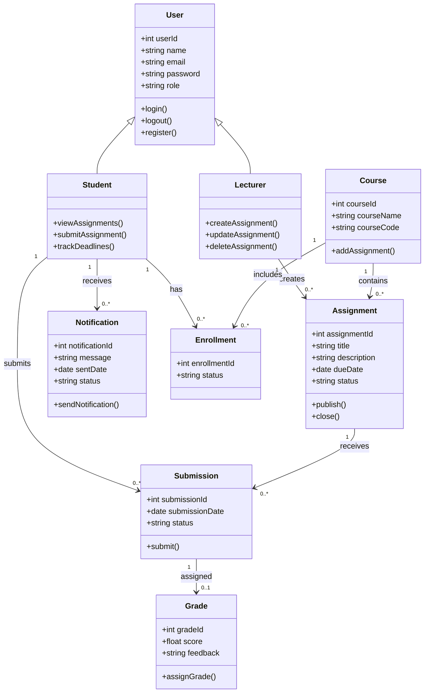

# 🧩 Class Diagram — Student Assignment Tracker

---

🧠 Explanation
Purpose

The class diagram expands on the domain model by showing:

System structure
Object responsibilities
Operations/methods
Relationships between classes
Key Design Features
Inheritance
Student and Lecturer inherit from User
Association
Lecturer creates assignments
Students submit assignments
Courses contain assignments
Encapsulation
Each class owns its own attributes and behavior
Traceability

Supports:

FR1 → Registration
FR2 → Login
FR3 → Assignment Creation
FR4 → Assignment Viewing
FR7 → Deadline Tracking
FR8 → Submission Tracking
FR9 → Notifications

---

