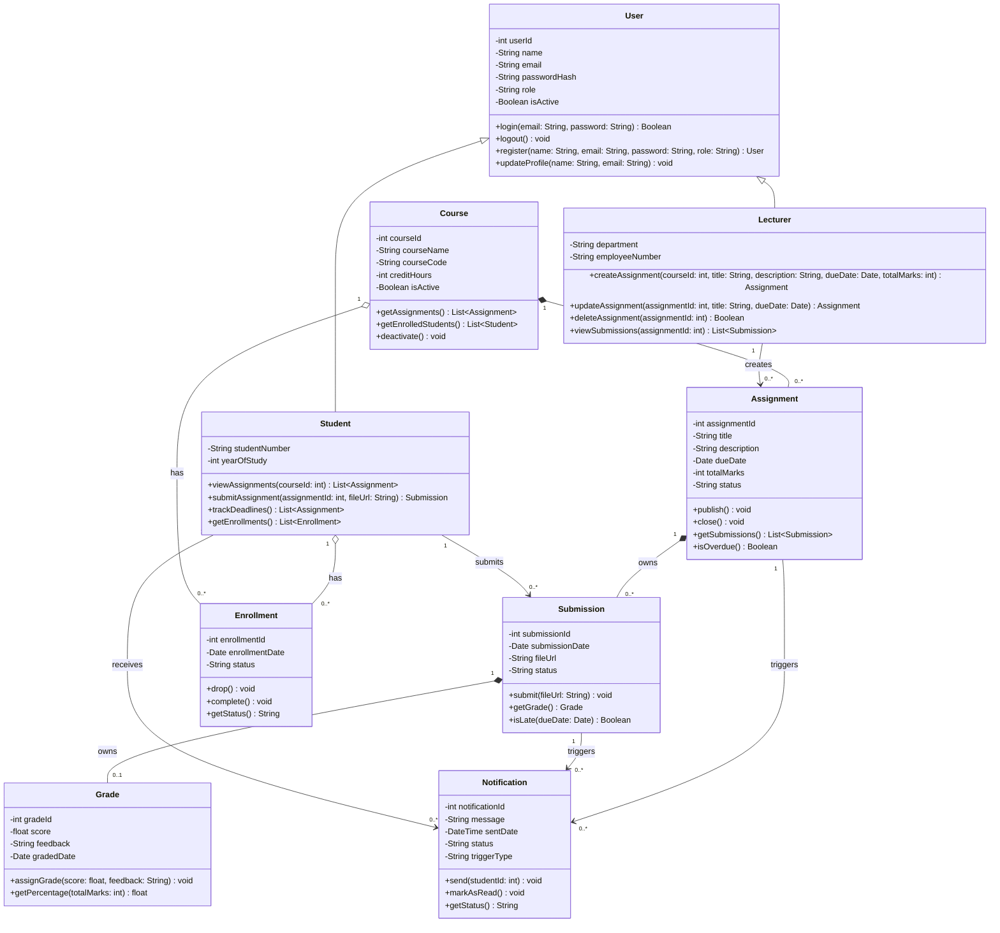

# 🧩 Class Diagram — Student Assignment Tracker

## 📌 Purpose

The class diagram expands on the domain model by introducing:

* **Typed attributes** — all fields carry explicit data types
* **Access modifiers** — public (`+`), private (`-`), protected (`#`)
* **Methods with signatures** — parameters and return types on all operations
* **Precise relationship types** — inheritance, composition, aggregation, and association clearly distinguished
* **Correct cardinality** — all multiplicities explicitly stated

---

## 📊 Class Diagram

---

## 🧠 Explanation

### Key Design Features

---

#### 🔐 Access Modifiers

All attributes are marked **private (`-`)** — they are accessed and mutated only through public methods, enforcing encapsulation. All methods are **public (`+`)** unless they are internal helpers.

| Modifier | Symbol | Usage in this diagram                      |
|----------|--------|--------------------------------------------|
| Private  | `-`    | All class attributes                       |
| Public   | `+`    | All exposed methods                        |

---

#### 🧬 Inheritance (Generalisation)

`Student` and `Lecturer` both inherit from `User`, sharing:

* `userId`, `name`, `email`, `passwordHash`, `role`, `isActive`
* `login()`, `logout()`, `register()`, `updateProfile()`

Each subclass extends the base with domain-specific attributes and operations.

---

#### 🔗 Relationship Types

This diagram distinguishes three levels of association:

| Relationship  | Symbol | Meaning                                                          | Example in this diagram              |
|---------------|--------|------------------------------------------------------------------|--------------------------------------|
| Composition   | `*--`  | Strong ownership; child cannot exist without parent             | `Course` owns `Assignment`           |
| Aggregation   | `o--`  | Weak ownership; child can exist independently                   | `Student` has `Enrollment`           |
| Association   | `-->`  | Directional use relationship; no ownership implied              | `Lecturer` creates `Assignment`      |
| Inheritance   | `<\|--`| Subclass extends superclass                                     | `Student` extends `User`             |

---

#### 📐 Method Signatures

All methods include **typed parameters** and **return types**, making the diagram implementation-ready.

Examples:

* `login(email: String, password: String) Boolean` — returns success/failure
* `submitAssignment(assignmentId: int, fileUrl: String) Submission` — returns the created submission
* `getPercentage(totalMarks: int) float` — computes a derived value
* `isOverdue() Boolean` — derived property based on `dueDate`

---

#### 🧩 Enrollment as an Association Class

`Enrollment` resolves the **many-to-many** relationship between `Student` and `Course`. There is **no direct Student ↔ Course association** — all membership is captured through `Enrollment`, which carries its own state (`enrollmentDate`, `status`) and behaviour (`drop()`, `complete()`).

---

#### 🔔 Notification — Typed Triggers

`Notification` now carries a `triggerType` attribute (`DEADLINE` | `SUBMISSION` | `GRADE`) and is linked to both `Assignment` and `Submission` as trigger sources. This means every notification in the system has an explicit, traceable origin.

---

## 🔗 Relationship Summary

| Relationship                        | Type        | Cardinality | Notes                                         |
|-------------------------------------|-------------|-------------|-----------------------------------------------|
| User → Student                      | Inheritance | —           | Student extends User                          |
| User → Lecturer                     | Inheritance | —           | Lecturer extends User                         |
| Lecturer creates Assignment         | Association | 1 to 0..*   | Lecturer manages assignment lifecycle         |
| Course owns Assignment              | Composition | 1 to 0..*   | Assignment cannot exist without a Course      |
| Student submits Submission          | Association | 1 to 0..*   | Student acts on an existing assignment        |
| Assignment owns Submission          | Composition | 1 to 0..*   | Submission cannot exist without an Assignment |
| Submission owns Grade               | Composition | 1 to 0..1   | A submission may have zero or one grade       |
| Student has Enrollment              | Aggregation | 1 to 0..*   | Enrollment record ties student to course      |
| Course has Enrollment               | Aggregation | 1 to 0..*   | Enrollment record ties course to student      |
| Assignment triggers Notification    | Association | 1 to 0..*   | Deadline alerts                               |
| Submission triggers Notification    | Association | 1 to 0..*   | Confirmation and grade alerts                 |
| Student receives Notification       | Association | 1 to 0..*   | Delivered to the relevant student             |

---

## 🎯 Traceability

| Requirement              | Classes / Methods Involved                                                                 |
|--------------------------|--------------------------------------------------------------------------------------------|
| FR1: User Registration   | `User.register()`, `Student`, `Lecturer`                                                   |
| FR2: User Authentication | `User.login()`, `User.logout()`, `User.passwordHash`, `User.isActive`                      |
| FR3: Assignment Creation | `Lecturer.createAssignment()`, `Assignment`, `Course`                                      |
| FR4: Assignment Viewing  | `Student.viewAssignments()`, `Course.getAssignments()`                                     |
| FR7: Deadline Tracking   | `Student.trackDeadlines()`, `Assignment.dueDate`, `Assignment.isOverdue()`, `Notification.triggerType` |
| FR8: Submission Tracking | `Student.submitAssignment()`, `Submission`, `Submission.isLate()`, `Grade`                 |
| FR9: Notifications       | `Notification.send()`, `Notification.markAsRead()`, `Assignment → Notification`, `Submission → Notification` |