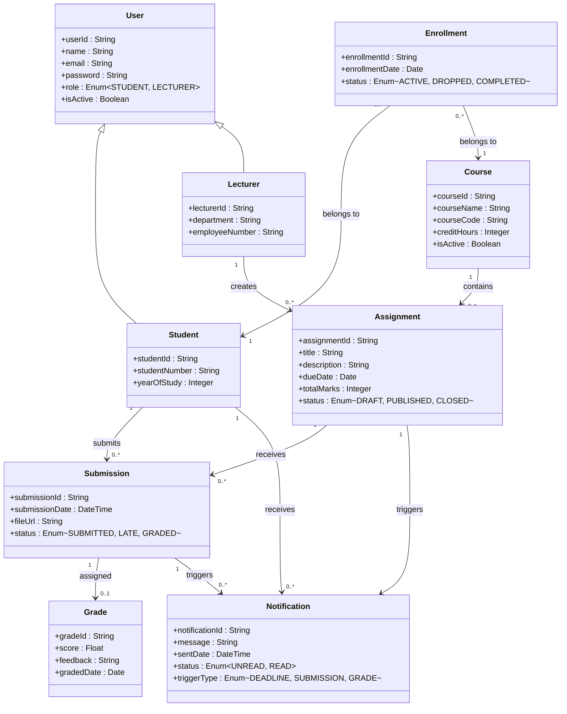

# 📘 Domain Model — Student Assignment Tracker

## 📌 Purpose

The domain model represents the key entities (classes) in the **Student Assignment Tracker** system and the relationships between them.

This model focuses on the **problem domain**, not implementation details.

It identifies:

* Core business objects and their attributes (with conceptual types)
* Relationships between entities (association, composition, generalisation)
* Cardinality (one-to-many, many-to-many)
* Real-world system structure

---

## 📊 Domain Model Diagram

---

## 🧠 Explanation

> **Note:** This is a **domain model**, not a design or implementation model. It captures real-world concepts, their attributes, and relationships — not system behaviour or methods. Responsibilities listed below describe what each entity *represents* in the domain, not functions it executes.

---

## 🔗 Main Entities

### **User**

Represents any authenticated system user.

| Attribute   | Type                      | Description                        |
|-------------|---------------------------|------------------------------------|
| userId      | String                    | Unique system identifier           |
| name        | String                    | Full display name                  |
| email       | String                    | Login credential / contact address |
| password    | String                    | Hashed credential                  |
| role        | Enum (STUDENT, LECTURER)  | Determines system access           |
| isActive    | Boolean                   | Account active state               |

Subclasses: **Student**, **Lecturer**

---

### **Student**

Represents a learner enrolled in the system.

| Attribute     | Type    | Description                        |
|---------------|---------|------------------------------------|
| studentId     | String  | Unique student record identifier   |
| studentNumber | String  | Institutional student number       |
| yearOfStudy   | Integer | Current academic year              |

Domain role: The entity that submits work, tracks deadlines, and receives grades and notifications.

---

### **Lecturer**

Represents an instructor who manages coursework.

| Attribute       | Type   | Description                       |
|-----------------|--------|-----------------------------------|
| lecturerId      | String | Unique lecturer record identifier |
| department      | String | Academic department               |
| employeeNumber  | String | Institutional staff number        |

Domain role: The entity that creates and manages assignments for courses.

---

### **Course**

Represents an academic module or subject offered in the system.

| Attribute   | Type    | Description                          |
|-------------|---------|--------------------------------------|
| courseId    | String  | Unique course identifier             |
| courseName  | String  | Full course title                    |
| courseCode  | String  | Short institutional code (e.g. CS301)|
| creditHours | Integer | Credit weight of the course          |
| isActive    | Boolean | Whether course is currently offered  |

Domain role: Groups assignments and connects to students via enrollments.

---

### **Assignment**

Represents coursework created by a lecturer for a specific course.

| Attribute    | Type                        | Description                          |
|--------------|-----------------------------|--------------------------------------|
| assignmentId | String                      | Unique assignment identifier         |
| title        | String                      | Assignment heading                   |
| description  | String                      | Full task description                |
| dueDate      | Date                        | Submission deadline                  |
| totalMarks   | Integer                     | Maximum achievable score             |
| status       | Enum (DRAFT, PUBLISHED, CLOSED) | Lifecycle state of the assignment|

Domain role: The central academic task entity that receives submissions and triggers notifications.

---

### **Submission**

Represents a student's response to a specific assignment.

| Attribute      | Type                             | Description                   |
|----------------|----------------------------------|-------------------------------|
| submissionId   | String                           | Unique submission identifier  |
| submissionDate | DateTime                         | Timestamp of submission       |
| fileUrl        | String                           | Location of submitted file    |
| status         | Enum (SUBMITTED, LATE, GRADED)   | Current submission state      |

Domain role: Records student work and links to a grade once assessed.

---

### **Grade**

Represents the assessed result of a submission.

| Attribute   | Type   | Description                          |
|-------------|--------|--------------------------------------|
| gradeId     | String | Unique grade record identifier       |
| score       | Float  | Numeric mark awarded                 |
| feedback    | String | Qualitative comments from lecturer   |
| gradedDate  | Date   | Date the grade was assigned          |

Domain role: Captures the outcome of assessment; zero or one per submission (a submission may be ungraded).

---

### **Notification**

Represents a system-generated alert sent to a student, linked to a triggering event.

| Attribute   | Type                                    | Description                             |
|-------------|-----------------------------------------|-----------------------------------------|
| notificationId | String                               | Unique notification identifier          |
| message     | String                                  | Notification content                    |
| sentDate    | DateTime                                | When the notification was dispatched    |
| status      | Enum (UNREAD, READ)                     | Read state                              |
| triggerType | Enum (DEADLINE, SUBMISSION, GRADE)      | What event caused this notification     |

Domain role: Connects back to `Assignment` (deadline reminders) or `Submission` (confirmation/grade alerts), making the trigger explicit and traceable.

---

### **Enrollment**

Represents the formal registration of a student in a course.

| Attribute      | Type                              | Description                          |
|----------------|-----------------------------------|--------------------------------------|
| enrollmentId   | String                            | Unique enrollment record identifier  |
| enrollmentDate | Date                              | Date of registration                 |
| status         | Enum (ACTIVE, DROPPED, COMPLETED) | Current enrollment state             |

Domain role: Resolves the many-to-many relationship between `Student` and `Course`. Replaces any direct Student ↔ Course association — all course membership is captured through this entity.

---

## 🔗 Relationship Summary

| Relationship                        | Type         | Notes                                                        |
|-------------------------------------|--------------|--------------------------------------------------------------|
| User generalises Student            | Inheritance  | Student inherits all User attributes                         |
| User generalises Lecturer           | Inheritance  | Lecturer inherits all User attributes                        |
| Lecturer creates Assignment         | One-to-Many  | A lecturer may create many assignments                       |
| Course contains Assignment          | One-to-Many  | A course holds many assignments                              |
| Enrollment belongs to Student       | Many-to-One  | Each enrollment record links to one student                  |
| Enrollment belongs to Course        | Many-to-One  | Each enrollment record links to one course                   |
| Student submits Submission          | One-to-Many  | A student may submit to many assignments                     |
| Assignment receives Submission      | One-to-Many  | An assignment may receive many submissions                   |
| Submission assigned Grade           | One-to-Zero/One | A submission has at most one grade                        |
| Assignment triggers Notification    | One-to-Many  | Deadline events generate notifications                       |
| Submission triggers Notification    | One-to-Many  | Submission/grade events generate notifications               |
| Student receives Notification       | One-to-Many  | A student may receive many notifications                     |

> ⚠️ **Design Note:** There is **no direct relationship** between `Student` and `Course`. All course membership is modelled exclusively through the `Enrollment` entity to avoid redundancy and preserve data integrity.

---

## 🎯 Traceability

This domain model aligns with:

### Functional Requirements

| Requirement | Entity/Relationship Covered                         |
|-------------|-----------------------------------------------------|
| FR1: User Registration   | `User`, `Student`, `Lecturer` (inheritance)    |
| FR2: User Authentication | `User.email`, `User.password`, `User.isActive` |
| FR3: Assignment Creation | `Assignment`, `Lecturer → Assignment`          |
| FR4: Assignment Viewing  | `Assignment`, `Enrollment`, `Course`           |
| FR7: Deadline Tracking   | `Assignment.dueDate`, `Notification.triggerType = DEADLINE` |
| FR8: Submission Tracking | `Submission`, `Submission.status`, `Grade`     |
| FR9: Notifications       | `Notification`, `Assignment → Notification`, `Submission → Notification` |

---

### Use Cases

| Use Case               | Domain Entities Involved                              |
|------------------------|-------------------------------------------------------|
| UC1: Register Account  | `User`, `Student`, `Lecturer`                         |
| UC2: Login             | `User.email`, `User.password`                         |
| UC3: Create Assignment | `Lecturer`, `Assignment`, `Course`                    |
| UC4: View Assignments  | `Assignment`, `Enrollment`, `Course`                  |
| UC7: Track Deadlines   | `Assignment.dueDate`, `Notification`                  |
| UC8: Submit Assignment | `Submission`, `Assignment`, `Student`                 |
| UC9: Receive Notifications | `Notification`, `Student`, `Assignment`, `Submission` |
