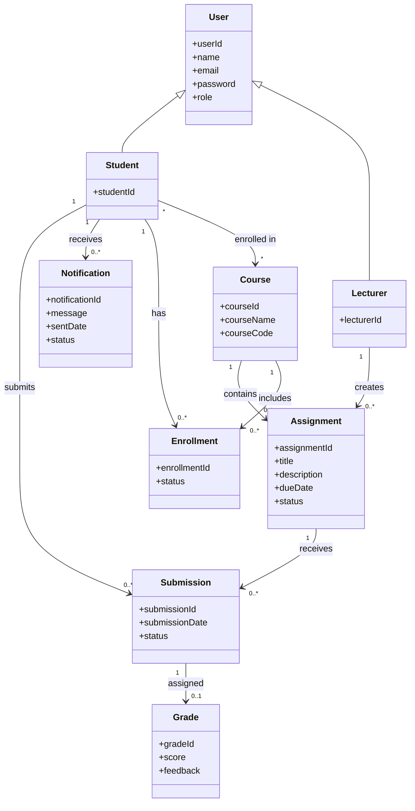

# 📘 Domain Model — Student Assignment Tracker

## 📌 Purpose

The domain model represents the key entities (classes) in the Student Assignment Tracker system and the relationships between them.

This model focuses on the **problem domain**, not implementation details.

It identifies:

* Core business objects
* Relationships between entities
* Cardinality (one-to-many, many-to-many)
* Real-world system structure

---

# 📊 Domain Model Diagram

---

# 🧠 Explanation

## 🔗 Main Entities

### **User**

Represents any authenticated system user.

Subclasses:

* Student
* Lecturer

---

### **Student**

Represents learners using the system.

Responsibilities:

* View assignments
* Track deadlines
* Submit assignments
* Receive notifications

---

### **Lecturer**

Represents instructors who manage coursework.

Responsibilities:

* Create assignments
* Update assignments
* Delete assignments

---

### **Course**

Represents academic modules or subjects.

Responsibilities:

* Organize assignments
* Group students through enrollment

---

### **Assignment**

Represents coursework created by lecturers.

Attributes include:

* Title
* Description
* Due date
* Status

---

### **Submission**

Represents student work submitted for an assignment.

Attributes include:

* Submission date
* Submission status

---

### **Grade**

Represents assessment results.

Attributes include:

* Score
* Feedback

---

### **Notification**

Represents reminders or alerts.

Examples:

* Deadline reminders
* Submission confirmations

---

### **Enrollment**

Represents the relationship between students and courses.

Used to model:

* Course registration
* Student access control

---

# 🔗 Relationship Summary

| Relationship                   | Type         |
| ------------------------------ | ------------ |
| Lecturer creates Assignment    | One-to-Many  |
| Course contains Assignment     | One-to-Many  |
| Student submits Submission     | One-to-Many  |
| Assignment receives Submission | One-to-Many  |
| Submission receives Grade      | One-to-One   |
| Student receives Notification  | One-to-Many  |
| Student enrolls in Course      | Many-to-Many |

---

# 🎯 Traceability

This domain model aligns with:

### Functional Requirements

* FR1: User Registration
* FR2: User Authentication
* FR3: Assignment Creation
* FR4: Assignment Viewing
* FR7: Deadline Tracking
* FR8: Submission Tracking
* FR9: Notifications

---

### Use Cases

* UC1: Register Account
* UC2: Login
* UC3: Create Assignment
* UC4: View Assignments
* UC7: Track Deadlines
* UC8: Submit Assignment
* UC9: Receive Notifications

---

