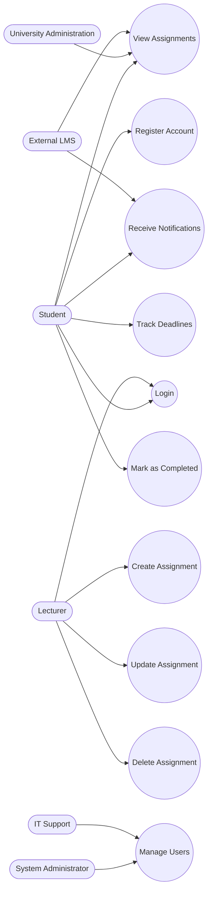

# Use Case Diagram – Student Assignment Tracker

## Use Case Diagram (Mermaid)

## Explanation

### Key Actors and Roles

* **Student**: Interacts with the system to view assignments, track deadlines, and mark tasks as completed.
* **Lecturer**: Responsible for creating, updating, and deleting assignments.
* **System Administrator**: Manages users and system access.
* **IT Support Staff**: Maintains system functionality and supports user management.
* **University Administration**: Monitors academic progress and assignment data.
* **External LMS**: Integrates with the system to provide assignment data and notifications.

---

### Relationships Between Actors and Use Cases

* Students interact with core use cases such as viewing assignments and tracking deadlines.
* Lecturers are responsible for managing assignment lifecycle (create, update, delete).
* The "Receive Notifications" use case is indirectly supported by the LMS system.
* The "Manage Users" use case is shared between System Administrator and IT Support.

---

### Alignment with Stakeholder Concerns

* Students' need for organization is addressed through "Track Deadlines" and "Receive Notifications."
* Lecturers' need for efficiency is supported by assignment management use cases.
* IT and administrators’ concerns about system control are handled via "Manage Users."
* Integration with LMS ensures data consistency and reduces duplication.

This ensures the system meets both functional requirements and stakeholder expectations defined in Assignment 4.
