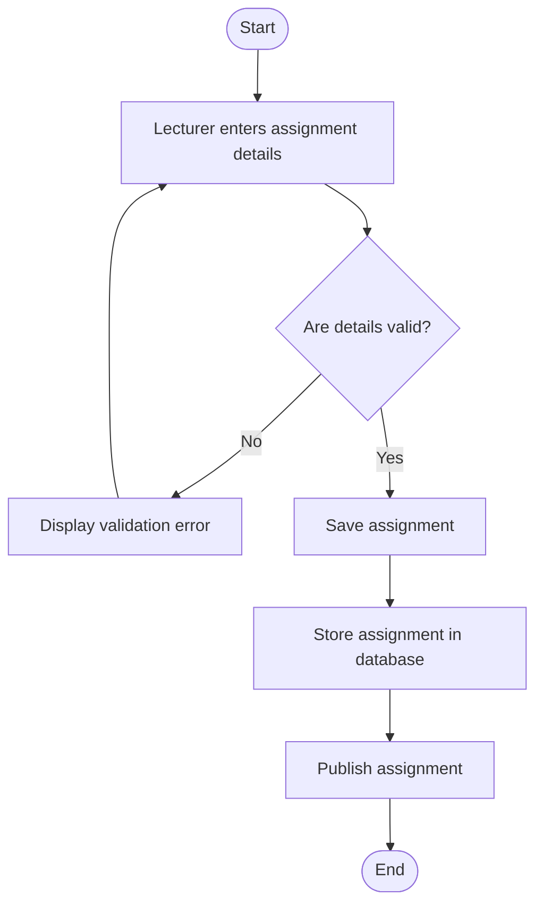

# 📝 Create Assignment Activity Diagram


---

```markdown
## 📌 Explanation

This activity diagram represents the process of creating and publishing an assignment by a lecturer.

### 🔄 Workflow Description

- The process begins when the lecturer enters assignment details such as title, description, and due date.
- The system validates the input data.
- If the data is invalid, an error message is shown and the lecturer must correct the input.
- If valid, the assignment is saved and stored in the database.
- The assignment is then published and made available to students.

### 🔗 Traceability

- **Functional Requirements**
  - FR3: Assignment Creation

- **Use Cases**
  - UC3: Create Assignment

- **User Stories**
  - US-003: Create assignments

This workflow ensures that assignments are created accurately and made available to students in a controlled and validated manner.
