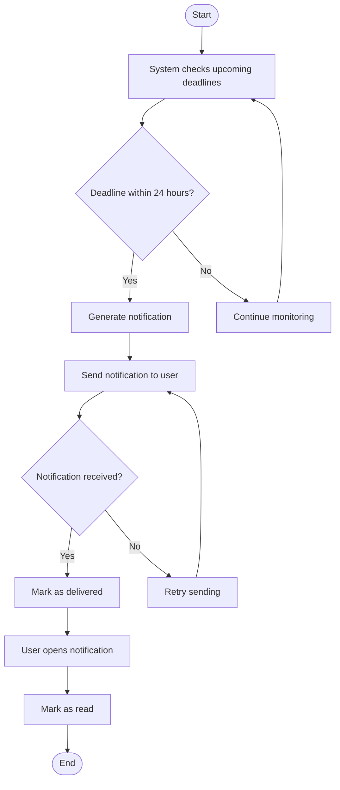

# 🔔 Receive Notifications Activity Diagram


---

```markdown

## 📌 Explanation

This activity diagram represents how the system generates, sends, and tracks notifications for users.

### 🔄 Workflow Description

- The system continuously checks for upcoming deadlines.
- If a deadline is within 24 hours, a notification is generated.
- The notification is sent to the user.
- If the notification is successfully received, it is marked as delivered.
- The user can open and read the notification.
- If sending fails, the system retries delivery.
- If no deadlines are approaching, the system continues monitoring.

### 🔗 Traceability

- **Functional Requirements**
  - FR9: Notifications

- **Use Cases**
  - UC9: Receive Notifications

- **User Stories**
  - US-009: Receive notifications

This workflow ensures timely notification delivery, retry handling, and user interaction tracking.
---