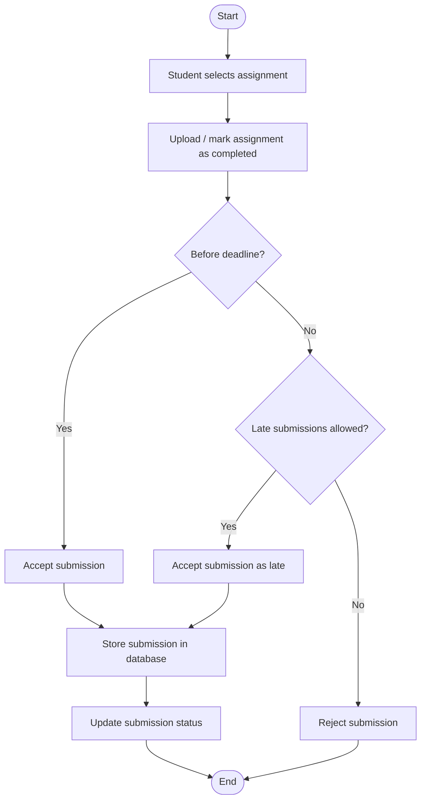

# 📤 Submit Assignment Activity Diagram


---

```markdown

## 📌 Explanation

This activity diagram represents the process of submitting an assignment within the system.

### 🔄 Workflow Description

- The process begins when the student selects an assignment.
- The student uploads the assignment or marks it as completed.
- The system checks whether the submission is before the deadline.
- If submitted on time, the submission is accepted.
- If late, the system checks if late submissions are allowed:
  - If allowed, the submission is accepted as late.
  - If not allowed, the submission is rejected.
- Accepted submissions are stored in the database and the status is updated.

### 🔗 Traceability

- **Functional Requirements**
  - FR8: Submission Tracking
  - FR7: Deadline Tracking (deadline check)

- **Use Cases**
  - UC8: Mark as Completed / Submit Assignment
  - UC7: Track Deadlines

- **User Stories**
  - US-008: Mark assignments as completed
  - US-007: Track deadlines

This workflow ensures proper handling of submissions, including deadline validation and late submission rules.
