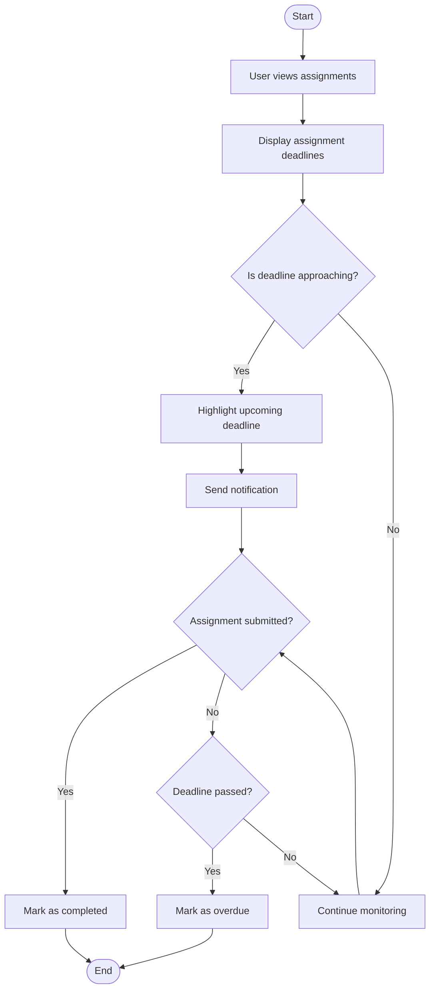

# ⏰ Track Deadlines Activity Diagram


---

```markdown
## 📌 Explanation

This activity diagram represents how the system tracks assignment deadlines and updates their status accordingly.

### 🔄 Workflow Description

- The process begins when the user views assignments.
- The system displays assignment deadlines.
- If a deadline is approaching, the system highlights it and sends a notification.
- The system checks whether the assignment has been submitted.
- If submitted, it is marked as completed.
- If not submitted and the deadline passes, it is marked as overdue.
- If neither condition is met, the system continues monitoring.

### 🔗 Traceability

- **Functional Requirements**
  - FR7: Deadline Tracking

- **Use Cases**
  - UC7: Track Deadlines

- **User Stories**
  - US-007: Track deadlines

This workflow ensures that deadlines are actively monitored, users are notified, and assignment status is updated appropriately.
