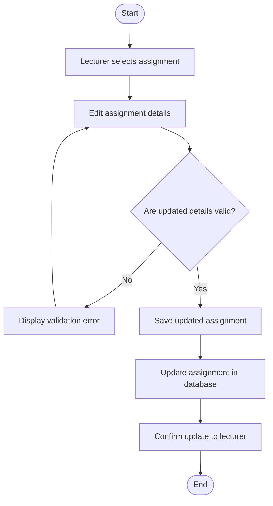

# ✏️ Update Assignment Activity Diagram

---

## 📌 Explanation

This activity diagram represents the process of updating an existing assignment by a lecturer.

### 🔄 Workflow Description

- The process begins when the lecturer selects an assignment to update.
- The lecturer edits the assignment details.
- The system validates the updated information.
- If invalid, an error message is displayed and the lecturer must correct the input.
- If valid, the updated assignment is saved and the database is updated.
- A confirmation message is displayed to the lecturer.

### 🔗 Traceability

- **Functional Requirements**
  - FR5: Assignment Updates

- **Use Cases**
  - UC5: Update Assignment

- **User Stories**
  - US-005: Update assignments

This workflow ensures that assignment updates are validated and correctly stored, maintaining data integrity within the system.
