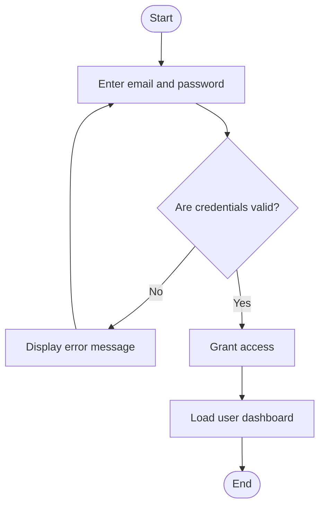

# 🔐 User Login Activity Diagram


---

```markdown

## 📌 Explanation

This activity diagram represents the user authentication process within the system.

### 🔄 Workflow Description

- The process begins when the user enters their login credentials.
- The system validates the credentials.
- If the credentials are invalid, an error message is displayed and the user retries.
- If valid, access is granted and the user dashboard is loaded.

### 🔗 Traceability

- **Functional Requirements**
  - FR2: User Authentication

- **Use Cases**
  - UC2: Login

- **User Stories**
  - US-002: User login

This workflow ensures secure access control and proper handling of invalid login attempts.
---