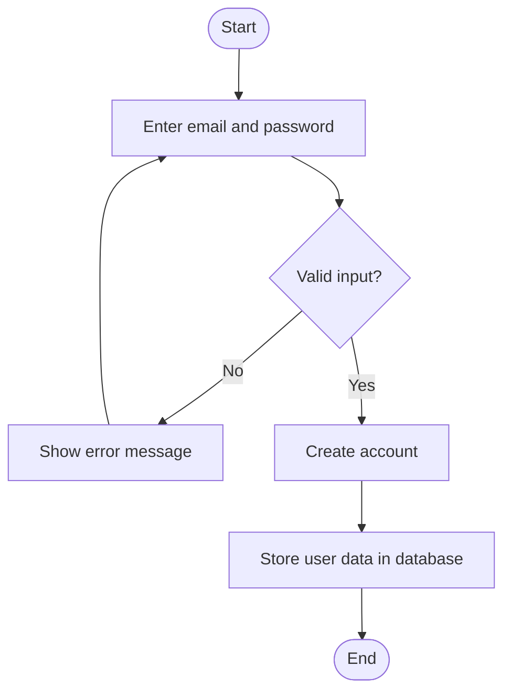

# 🧑‍💻 User Registration Activity Diagram

---

## 📌 Explanation

This activity diagram represents the process of user registration in the system.

### 🔄 Workflow Description

- The process begins when the user enters their email and password.
- The system validates the input.
- If the input is invalid, an error message is displayed and the user retries.
- If valid, the account is created and stored in the database.

### 🔗 Traceability

- **Functional Requirements**
  - FR1: User Registration

- **Use Cases**
  - UC1: Register Account

- **User Stories**
  - US-001: Register account

This workflow ensures proper validation and secure account creation.
