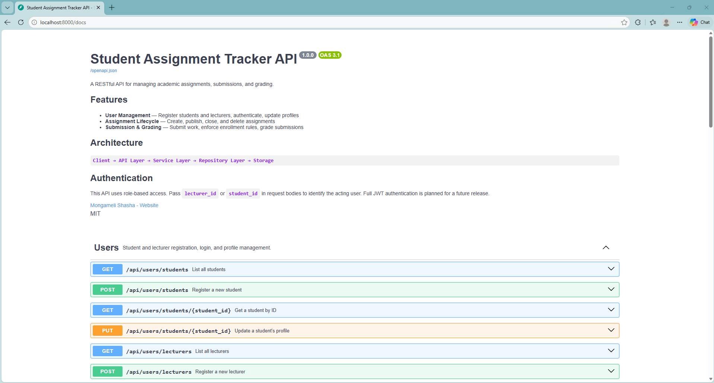
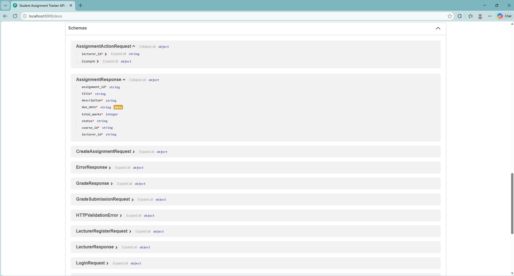

# 📖 API Documentation — Student Assignment Tracker

## Overview

The Student Assignment Tracker exposes a RESTful API built with **FastAPI**.
Documentation is available in three formats:

| Format | URL (local) | Description |
|--------|------------|-------------|
| Swagger UI | `http://localhost:8000/docs` | Interactive — try endpoints live |
| ReDoc | `http://localhost:8000/redoc` | Clean reference documentation |
| OpenAPI JSON | `http://localhost:8000/openapi.json` | Machine-readable spec |
| OpenAPI YAML | [`openapi.yaml`](./openapi.yaml) | Human-readable spec (this repo) |

---

## Swagger UI





---

## Running the API

```bash
# From the repo root
uvicorn api.main:app --reload
```

---

## Endpoint Reference

### 🔵 Health

| Method | Endpoint | Description |
|--------|----------|-------------|
| `GET` | `/health` | Returns 200 if the API is running |

---

### 👤 Users

| Method | Endpoint | Description | Status Codes |
|--------|----------|-------------|--------------|
| `POST` | `/api/users/students` | Register a new student | 201, 409, 422 |
| `GET` | `/api/users/students` | List all students | 200 |
| `GET` | `/api/users/students/{id}` | Get student by ID | 200, 404 |
| `PUT` | `/api/users/students/{id}` | Update student profile | 200, 404, 409 |
| `POST` | `/api/users/lecturers` | Register a new lecturer | 201, 409, 422 |
| `GET` | `/api/users/lecturers` | List all lecturers | 200 |
| `GET` | `/api/users/lecturers/{id}` | Get lecturer by ID | 200, 404 |
| `PUT` | `/api/users/lecturers/{id}` | Update lecturer profile | 200, 404, 409 |
| `POST` | `/api/users/login` | Authenticate a user | 200, 404, 422 |

---

### 📝 Assignments

| Method | Endpoint | Description | Status Codes |
|--------|----------|-------------|--------------|
| `POST` | `/api/assignments` | Create a new assignment (DRAFT) | 201, 404, 409, 422 |
| `GET` | `/api/assignments` | List all assignments | 200 |
| `GET` | `/api/assignments/{id}` | Get assignment by ID | 200, 404 |
| `PUT` | `/api/assignments/{id}` | Update title or due date | 200, 403, 404, 409 |
| `DELETE` | `/api/assignments/{id}?lecturer_id=` | Delete a DRAFT assignment | 200, 403, 404, 409 |
| `POST` | `/api/assignments/{id}/publish` | Publish (DRAFT → PUBLISHED) | 200, 403, 404, 409 |
| `POST` | `/api/assignments/{id}/close` | Close (PUBLISHED → CLOSED) | 200, 403, 404, 409 |
| `GET` | `/api/assignments/course/{course_id}` | Assignments for a course | 200, 404 |
| `GET` | `/api/assignments/lecturer/{lecturer_id}` | Assignments by a lecturer | 200, 404 |
| `GET` | `/api/assignments/overdue` | All overdue assignments | 200 |

---

### 📤 Submissions

| Method | Endpoint | Description | Status Codes |
|--------|----------|-------------|--------------|
| `POST` | `/api/submissions?assignment_id=` | Submit an assignment | 201, 403, 404, 409, 422 |
| `GET` | `/api/submissions/{id}` | Get submission by ID | 200, 404 |
| `GET` | `/api/submissions/assignment/{id}` | All submissions for an assignment | 200, 404 |
| `GET` | `/api/submissions/student/{id}` | All submissions by a student | 200, 404 |
| `POST` | `/api/submissions/{id}/grade` | Grade a submission | 201, 403, 404, 409, 422 |
| `GET` | `/api/submissions/{id}/grade` | Get grade for a submission | 200, 404 |

---

## Error Response Format

All errors return a consistent JSON structure:

```json
{
  "error": "NotFoundError",
  "detail": "Assignment with id 'a1' not found."
}
```

| HTTP Status | Error Type | Meaning |
|-------------|-----------|---------|
| `404` | `NotFoundError` | Entity does not exist |
| `409` | `ConflictError` | Business rule violation |
| `403` | `PermissionError` | Unauthorised action |
| `422` | `ValidationError` | Invalid input data |
| `500` | `ServiceError` | Unexpected server error |

---

## Business Rules

### Users
- Email must be unique across all users
- Student number must be unique across all students
- Employee number must be unique across all lecturers
- Accounts must be active before login is permitted

### Assignments
- Due date must be today or in the future at creation time
- Only the creating lecturer can publish, close, update, or delete an assignment
- Status transitions: `DRAFT → PUBLISHED → CLOSED` (no skipping, no reversal)
- Only `DRAFT` assignments can be deleted
- Cannot update a `CLOSED` assignment

### Submissions
- Students must be actively enrolled in the assignment's course
- Only `PUBLISHED` assignments accept submissions
- One submission per student per assignment
- Score must be between `0` and the assignment's `total_marks`
- A submission can only be graded once

---

## Example Workflows

### Register → Enroll → Submit → Grade

```bash
# 1. Register a lecturer
POST /api/users/lecturers
{"user_id":"l1","name":"Dr Nkosi","email":"nkosi@uni.ac.za",
 "password":"pass","department":"CS","employee_number":"EMP001"}

# 2. Register a student
POST /api/users/students
{"user_id":"s1","name":"Alice","email":"alice@uni.ac.za",
 "password":"pass","student_number":"219181527","year_of_study":3}

# 3. Create an assignment (course must exist in the repository)
POST /api/assignments
{"lecturer_id":"l1","course_id":"c1","title":"Domain Model",
 "description":"Build it.","due_date":"2026-06-01","total_marks":100}

# 4. Publish the assignment
POST /api/assignments/{assignment_id}/publish
{"lecturer_id":"l1"}

# 5. Student submits
POST /api/submissions?assignment_id={assignment_id}
{"student_id":"s1","file_url":"https://github.com/student/repo"}

# 6. Lecturer grades
POST /api/submissions/{submission_id}/grade
{"lecturer_id":"l1","score":85.0,"feedback":"Well done."}

# 7. Check the grade
GET /api/submissions/{submission_id}/grade
```

---

## Generating the OpenAPI Spec

To regenerate `openapi.json` from the live app:

```bash
python docs/export_openapi.py
```

Or fetch directly from the running server:

```bash
curl http://localhost:8000/openapi.json -o docs/api/openapi.json
```