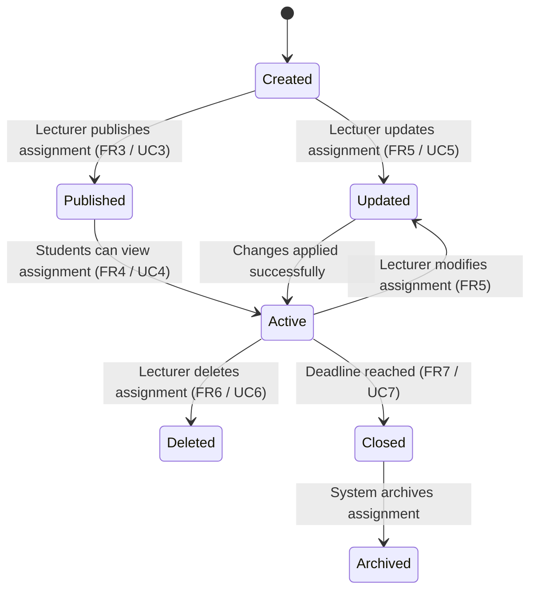

# 📊 State Transition Diagram




```markdown
## 📌 Explanation

The Assignment object represents the lifecycle of an assignment created and managed within the system.

### 🔄 Key States

- **Created**: Assignment is initially created by the lecturer (FR3, UC3, US-003)
- **Published**: Assignment becomes visible to students (FR4, UC4, US-004)
- **Active**: Students can interact with the assignment (view, track deadlines)
- **Updated**: Assignment details are modified (FR5, UC5, US-005)
- **Closed**: Assignment deadline has passed (FR7, UC7, US-007)
- **Deleted**: Assignment removed from the system (FR6, UC6, US-006)
- **Archived**: Assignment stored for historical purposes

### 🔗 Traceability

This diagram aligns with:

- **Functional Requirements**
  - FR3: Assignment Creation
  - FR4: Assignment Viewing
  - FR5: Assignment Updates
  - FR6: Assignment Deletion
  - FR7: Deadline Tracking

- **Use Cases**
  - UC3: Create Assignment
  - UC4: View Assignments
  - UC5: Update Assignment
  - UC6: Delete Assignment
  - UC7: Track Deadlines

- **User Stories**
  - US-003: Create assignments
  - US-004: View assignments
  - US-005: Update assignments
  - US-006: Delete assignments
  - US-007: Track deadlines

This ensures consistency between system behavior and previously defined requirements.