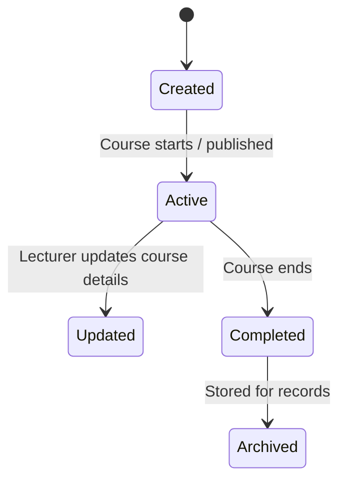

# 📚 Course State Transition Diagram



```markdown

## 📌 Explanation

The Course object represents the lifecycle of an academic course within the system, which groups assignments and enrolled students.

### 🔄 Key States

- **Created**: The course is created by the lecturer or administrator
- **Active**: The course is running and available to students
- **Updated**: Course details (e.g., name, schedule) are modified
- **Completed**: The course has ended
- **Archived**: The course is stored for historical and record-keeping purposes

### 🔗 Traceability

This object indirectly supports:

- **Functional Requirements**
  - FR3: Assignment Creation (assignments belong to courses)
  - FR4: Assignment Viewing (students view assignments within courses)

- **Use Cases**
  - UC3: Create Assignment
  - UC4: View Assignments

- **User Stories**
  - US-003: Create assignments
  - US-004: View assignments

Although not explicitly defined as a standalone requirement, the Course object provides essential structure for organizing assignments and managing academic workflows within the system.