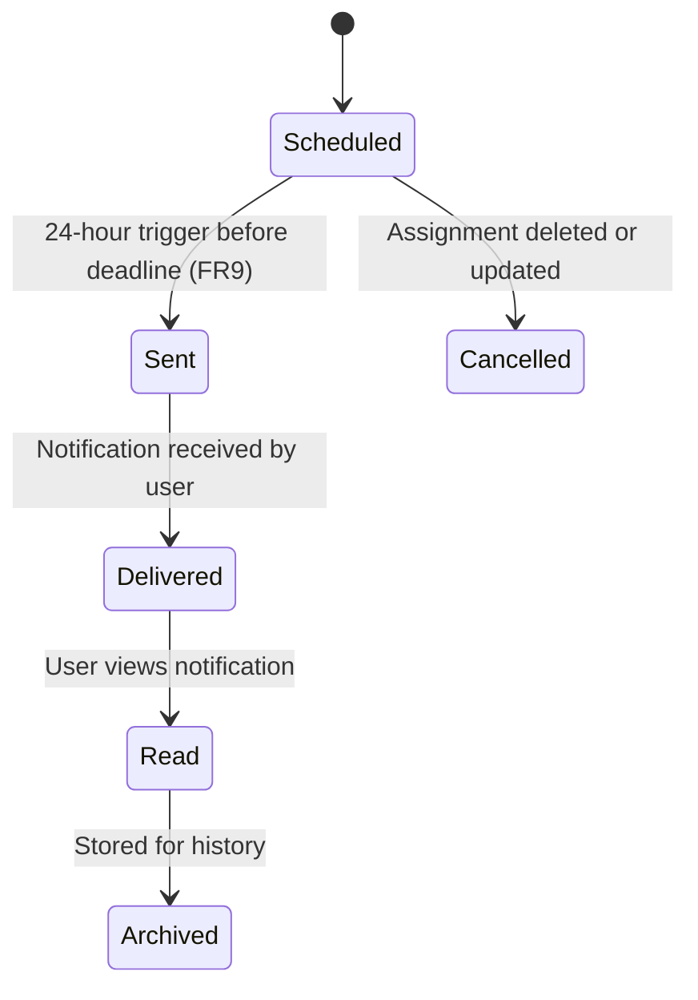

# 🔔 Notification State Transition Diagram



```markdown

  ## 📌 Explanation

The Notification object represents the lifecycle of system-generated alerts that inform users about important events such as upcoming deadlines.

### 🔄 Key States

- **Scheduled**: Notification is created and scheduled to be sent (FR9)
- **Sent**: Notification is triggered and sent to the user (US-009)
- **Delivered**: Notification is successfully received by the user
- **Read**: The user has viewed the notification
- **Cancelled**: Notification is cancelled due to changes (e.g., assignment deleted)
- **Archived**: Notification is stored for record-keeping

### 🔗 Traceability

This diagram aligns with:

- **Functional Requirements**
  - FR9: Notifications

- **Use Cases**
  - UC9: Receive Notifications

- **User Stories**
  - US-009: Receive notifications

This ensures that notification scheduling, delivery, and user interaction are clearly modeled within the system.  