# 🗂️ Updated Class Diagram — Repository Layer
## Student Assignment Tracker — Assignment 11

This diagram extends the Assignment 9 class diagram to show the full
repository layer: interfaces, in-memory implementations, filesystem
implementations, and the factory abstraction mechanism.

---

## 📊 Repository Layer Diagram

```mermaid
classDiagram

%% ─── Generic Base ────────────────────────────────────────────────────────
class Repository {
    <<interface>>
    +save(entity: T) void
    +find_by_id(entity_id: ID) T
    +find_all() List~T~
    +delete(entity_id: ID) void
    +exists(entity_id: ID) Boolean
    +count() int
}

%% ─── Entity-Specific Interfaces ─────────────────────────────────────────
class StudentRepository {
    <<interface>>
    +find_by_student_number(student_number: String) Student
    +find_by_course(course_id: String) List~Student~
}

class AssignmentRepository {
    <<interface>>
    +find_by_course(course_id: String) List~Assignment~
    +find_by_lecturer(lecturer_id: String) List~Assignment~
    +find_by_status(status: String) List~Assignment~
    +find_overdue() List~Assignment~
}

class SubmissionRepository {
    <<interface>>
    +find_by_student(student_id: String) List~Submission~
    +find_by_assignment(assignment_id: String) List~Submission~
    +find_by_status(status: String) List~Submission~
    +find_by_student_and_assignment(student_id: String, assignment_id: String) Submission
}

class EnrollmentRepository {
    <<interface>>
    +find_by_student(student_id: String) List~Enrollment~
    +find_by_course(course_id: String) List~Enrollment~
    +find_by_student_and_course(student_id: String, course_id: String) Enrollment
    +find_by_status(status: String) List~Enrollment~
}

class NotificationRepository {
    <<interface>>
    +find_by_student(student_id: String) List~Notification~
    +find_unread_by_student(student_id: String) List~Notification~
    +find_by_trigger_type(trigger_type: String) List~Notification~
}

%% ─── Inheritance: interfaces extend generic base ─────────────────────────
Repository <|-- StudentRepository
Repository <|-- AssignmentRepository
Repository <|-- SubmissionRepository
Repository <|-- EnrollmentRepository
Repository <|-- NotificationRepository

%% ─── In-Memory Implementations ──────────────────────────────────────────
class InMemoryRepository {
    -_storage: dict
    +save(entity: T) void
    +find_by_id(entity_id: ID) T
    +find_all() List~T~
    +delete(entity_id: ID) void
    +exists(entity_id: ID) Boolean
    +count() int
    #_get_id(entity: T) String
}

class InMemoryStudentRepository {
    +find_by_student_number(student_number: String) Student
    +find_by_course(course_id: String) List~Student~
}

class InMemoryAssignmentRepository {
    +find_by_course(course_id: String) List~Assignment~
    +find_by_lecturer(lecturer_id: String) List~Assignment~
    +find_by_status(status: String) List~Assignment~
    +find_overdue() List~Assignment~
}

class InMemorySubmissionRepository {
    +find_by_student(student_id: String) List~Submission~
    +find_by_assignment(assignment_id: String) List~Submission~
    +find_by_status(status: String) List~Submission~
    +find_by_student_and_assignment(student_id: String, assignment_id: String) Submission
}

class InMemoryEnrollmentRepository {
    +find_by_student(student_id: String) List~Enrollment~
    +find_by_course(course_id: String) List~Enrollment~
    +find_by_student_and_course(student_id: String, course_id: String) Enrollment
    +find_by_status(status: String) List~Enrollment~
}

InMemoryRepository <|-- InMemoryStudentRepository
InMemoryRepository <|-- InMemoryAssignmentRepository
InMemoryRepository <|-- InMemorySubmissionRepository
InMemoryRepository <|-- InMemoryEnrollmentRepository

StudentRepository <|.. InMemoryStudentRepository
AssignmentRepository <|.. InMemoryAssignmentRepository
SubmissionRepository <|.. InMemorySubmissionRepository
EnrollmentRepository <|.. InMemoryEnrollmentRepository

%% ─── FileSystem Implementations ─────────────────────────────────────────
class FileSystemRepository {
    -_file_path: String
    +save(entity: T) void
    +find_by_id(entity_id: ID) T
    +find_all() List~T~
    +delete(entity_id: ID) void
    +exists(entity_id: ID) Boolean
    +count() int
    #_serialize(entity: T) dict
    #_deserialize(data: dict) T
    #_load_raw() dict
    #_write_raw(data: dict) void
}

class FileSystemStudentRepository {
    +find_by_student_number(student_number: String) Student
    +find_by_course(course_id: String) List~Student~
    #_serialize(entity: Student) dict
    #_deserialize(data: dict) Student
}

class FileSystemCourseRepository {
    +find_by_code(course_code: String) Course
    +find_active() List~Course~
    #_serialize(entity: Course) dict
    #_deserialize(data: dict) Course
}

FileSystemRepository <|-- FileSystemStudentRepository
FileSystemRepository <|-- FileSystemCourseRepository
StudentRepository <|.. FileSystemStudentRepository

%% ─── Database Stubs ──────────────────────────────────────────────────────
class DatabaseStudentRepository {
    <<stub>>
    +save(entity: Student) void
    +find_by_id(entity_id: String) Student
    +find_all() List~Student~
    +delete(entity_id: String) void
    +find_by_student_number(student_number: String) Student
    +find_by_course(course_id: String) List~Student~
}

StudentRepository <|.. DatabaseStudentRepository

%% ─── Factory ─────────────────────────────────────────────────────────────
class RepositoryFactory {
    -_storage_type: String
    -_instances: dict
    +get_student_repository() StudentRepository
    +get_assignment_repository() AssignmentRepository
    +get_submission_repository() SubmissionRepository
    +get_enrollment_repository() EnrollmentRepository
    +get_notification_repository() NotificationRepository
    +storage_type() String
}

RepositoryFactory --> StudentRepository : creates
RepositoryFactory --> AssignmentRepository : creates
RepositoryFactory --> SubmissionRepository : creates
RepositoryFactory --> EnrollmentRepository : creates
```



---

## 🔗 Key Design Decisions

### 1. Generic Base → Entity Interface → Concrete Implementation

Every repository follows a strict three-layer hierarchy:

```
Repository[T, ID]           ← Generic base (6 CRUD methods)
    └── StudentRepository   ← Entity interface (+ domain-specific finders)
            ├── InMemoryStudentRepository    ← HashMap backend
            ├── FileSystemStudentRepository  ← JSON file backend
            └── DatabaseStudentRepository    ← SQL/NoSQL stub
```

Callers only ever depend on the interface layer (`StudentRepository`) —
never on the concrete class. Swapping backends is a one-line change in
`RepositoryFactory`.

### 2. Storage Backends Compared

| Feature | InMemory | FileSystem | Database (stub) |
|---------|----------|------------|-----------------|
| Persistence across restarts | ❌ | ✅ | ✅ |
| Object graph reconstruction | ✅ Full | ⚠️ Partial | ✅ Full (when implemented) |
| Query performance | O(n) scan | O(n) scan | O(log n) indexed |
| Setup required | None | None | DB server + driver |
| Use case | Testing, demos | Small datasets | Production |

### 3. Why Factory over Dependency Injection

A `RepositoryFactory` was chosen over DI because the storage backend
is a single application-wide decision made at startup — not a
per-component concern. DI would be more appropriate if different
services within the app needed different backends simultaneously.

### 4. Future-Proofing Checklist

To add a real database backend:
- [ ] Install SQLAlchemy (`pip install sqlalchemy`) or PyMongo (`pip install pymongo`)
- [ ] Create `repositories/database/implementations.py`
- [ ] Implement each `Database*Repository` class from `stubs.py`
- [ ] Change `RepositoryFactory(storage_type="DATABASE")`
- [ ] Zero changes needed to domain classes, services, or tests.